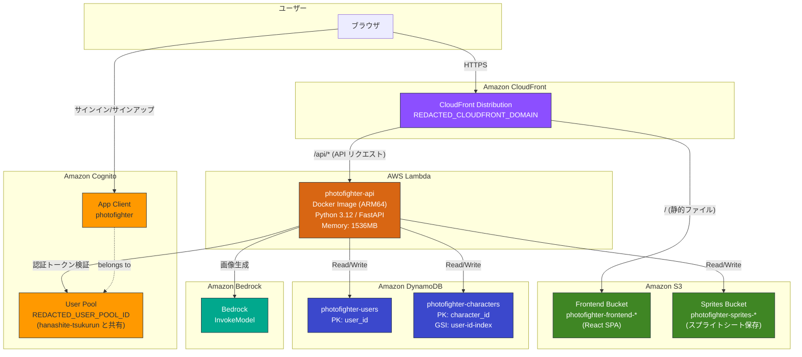

# PhotoFighter AWS 構成図

## リソース一覧

| サービス | リソース名 | 用途 |
|---------|-----------|------|
| CloudFront | FrontendDistribution | SPA 配信 + API リバースプロキシ |
| S3 | photofighter-frontend-* | フロントエンド静的ファイルホスティング |
| S3 | photofighter-sprites-* | キャラクタースプライトシート保存 (90日で自動削除) |
| Lambda | photofighter-api | FastAPI バックエンド (Docker, ARM64, 1536MB) |
| DynamoDB | photofighter-users | ユーザー情報テーブル |
| DynamoDB | photofighter-characters | キャラクター情報テーブル (GSI: user-id-index) |
| Cognito | REDACTED_USER_POOL_ID | ユーザー認証 (hanashite-tsukurun と共有) |
| Bedrock | InvokeModel | AI による画像生成 |

## アクセスパターン

1. **静的コンテンツ配信**: Browser → CloudFront → S3 (OAC 経由)
2. **API リクエスト**: Browser → CloudFront (`/api/*`) → Lambda Function URL
3. **認証**: Browser → Cognito App Client → User Pool (SRP / パスワード認証)
4. **背景除去**: Lambda → rembg (onnxruntime, ローカル処理)
5. **キャラクター生成**: Lambda → Bedrock (InvokeModel)
